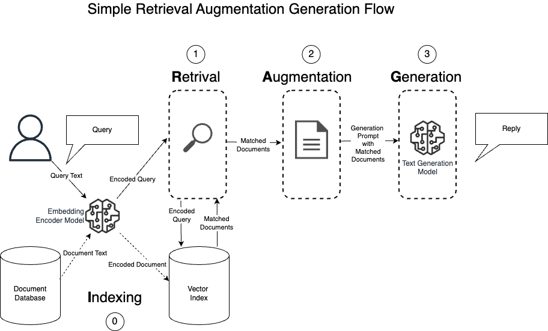
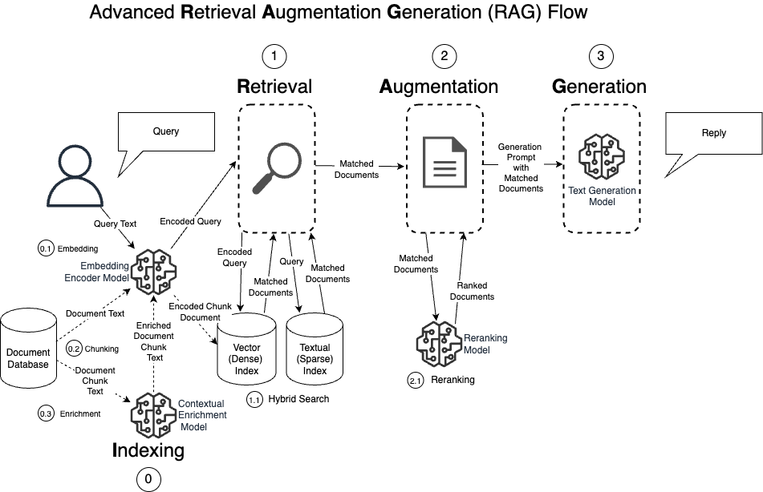

# Mastering Large Language Models (LLM) with Retrieval Augmented Generation (RAG)

This repository includes a set of assets that are used in the above course, which dives
deeper into the various problems and solutions when building a RAG system in enterprise environments.

The course is available on [edX](https://www.edx.org/learn/computer-science/pragmatic-ai-labs-advanced-rag).

## Simple RAG Flow



## Jupyter Notebooks

1. [Simple RAG](01_simple_rag.ipynb): This notebook introduces the fundamental concepts and implementation of Retrieval Augmented Generation (RAG). [](https://studiolab.sagemaker.aws/import/github/guyernest/advanced-rag/blob/main/01_simple_rag.ipynb) [](https://colab.research.google.com/github/guyernest/advanced-rag/blob/main/01_simple_rag.ipynb) 
2. [Embedding Model](02_embedding_model.ipynb): This notebook examines the role of embedding models in RAG systems, including their applications and limitations.
3. [Semantic Chunking](03_semantic_chunking.ipynb): This notebook investigates the process of semantic chunking in RAG systems, focusing on its significance in information retrieval.
4. [Contextual Retrieval](04_contextual_retrieval.ipynb): This notebook delves into the strategies for contextual retrieval in RAG systems, emphasizing the effective handling of numerical data and tables.
5. [Reverse Hyde](05_reverse_hyde.ipynb): This notebook explores the Reverse Hyde technique in RAG systems, highlighting its importance in addressing contextual relevance and query ambiguity.
6. [Hybrid Search](06_hybrid_search.ipynb): This notebook discusses the integration of hybrid search capabilities in RAG systems, encompassing both temporal relevance and multi-lingual support.
7. [Reranking](07_reranking.ipynb): This notebook discusses the importance of reranking in RAG systems, focusing on techniques to refine the initial retrieval results for more accurate and relevant outputs.
8. [Multi Modal Retrieval](08_multimodal_pdf.ipynb): This notebook explore the possibilities of retrieval from images and not limited to text. 

## Common Problems in RAG Systems and Their Solutions

The problematic part of a RAG application is usually the retrieval part. The system might retrieve the wrong documents, or only part of them and lead to wrong replies. This is the classical problem in machine learning of the precision-recall-tradeoff.


The following list of complexity factors in real-life documents can lead to a decrease in overall retrieval accuracy, and the various techniques that can improve the retrieval performance. 

1. **Long Documents**
  - Problem: Difficulty in processing and retrieving information from lengthy documents.
  - Solutions: 
    - Chunking options
      - Sentence-based chunking
      - Paragraph-based chunking
      - Fixed-size chunking with overlap
      - Statistical chunking (see: [03_semantic_chunking.ipynb](03_semantic_chunking.ipynb))
    - Hierarchical retrieval (e.g., parent-child chunks)
    - Contextual retrieval (see: [05_contextual_retrieval.ipynb](04_contextual_retrieval.ipynb))

2. **Mismatch Between Questions and Document Formats**
   - Problem: User queries may not align with the way information is structured in documents.
   - Solutions:
     - Hypothetical Document Embeddings (HyDE)
     - Reverse HyDE (see: [04_reverse_hyde.ipynb](05_reverse_hyde.ipynb))

3. **Domain-Specific Jargon**
   - Problem: General LLMs may struggle with specialized vocabulary.
   - Solutions:
     - Incorporating domain-specific embeddings (see: [02_embedding_model.ipynb](02_embedding_model.ipynb))
     - Hybrid Search (see: [06_hybrid_search.ipynb](06_hybrid_search.ipynb))
     - Fine-tuning on domain-specific corpora

4. **Complex Documents**
   - Problem: Handling documents with complex structures, such as scanned documents, which can be challenging for traditional text-based retrieval methods.
   - Solutions:
     - Multi-modal retrieval (see: [07_multimodal_pdf.ipynb](07_multimodal_pdf.ipynb))
       - Utilizing computer vision techniques to extract information from images and other non-textual elements within documents.
       - Integrating this information with text-based retrieval methods for a more comprehensive search capability.

## Advanced RAG System



## Set Up Local Jupyter

   To set up the project, you have two options: using `uv` or traditional `pip`.

   **Using [`uv`](https://github.com/astral-sh/uv)**

  ```shell
  pip install uv  # Install `uv`
  uv venv --python cpython-3.12.3-macos-aarch64-none   # Create a virtual environment for MacOS with Apple Silicon
  source .venv/bin/activate   # Activate the virtual environment.
  uv pip compile requirements.in --output-file requirements.txt # Compile the project dependencies
  uv pip install requirements.txt  # Sync the dependencies
  ```

  


  If the virtual environment doesn't find `pip` or other modules:
  ```shell
  curl https://bootstrap.pypa.io/get-pip.py -o get-pip.py  # get the pip package
  python3 get-pip.py # Install the pip package
  pip install ipykernel # Install ipykernel to add the support for Jupyter notebooks to VSC
  ```

  To execute the notebooks in a [Jupyter lab](https://jupyter.org/install) environment, you need to add the following commands
  ```shell
  python3 -m pip install jupyterlab # Install Jupyter Lab and ipykernel to manager kernels for Jupyter
  python3 -m ipykernel install --user --name=.venv --display-name="Python (.venv)" # Create kernel from the virtual environment
  jupyter lab
  ```
  And select the `Python (.venv)` from the kernel list.

   **Using traditional `pip`**

  1. Create a virtual environment using your preferred method (e.g., `python -m venv myenv`).
  2. Activate the virtual environment.
  3. Install the project dependencies using `pip install -r requirements.txt`.

   Note: The `uv` method is recommended for its speed, ease of use and management of project dependencies. However, the traditional `pip` method is also supported for those familiar with it.

## Setup in Google Colab

Follow the link to the first hands-on lab: [](https://colab.research.google.com/github/guyernest/advanced-rag/blob/main/01_simple_rag.ipynb) 

Before the first cells add the following commands

```
!git clone https://github.com/guyernest/advanced-rag.git
%cd advanced-rag
!pip install -q -r requirements.txt
```

You might need to restart the Colab runtime at the end of the dependencies installation. Remember to change back to the course folder:

```
%cd advanced-rag
```

## Setup in SageMaker Studio Lab

Follow the link to the first hands-on lab: [](https://studiolab.sagemaker.aws/import/github/guyernest/advanced-rag/blob/main/01_simple_rag.ipynb)

Clone the GitHub repository when prompted by the service.

Before the first cells add the following commands:

```
%cd advanced-rag
!pip install -q -r requirements.txt
```
